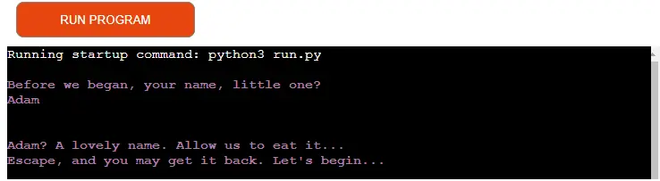

# Escape the Cellar
Escape the Cellar is a python-based text adventure that challenges the user to escape a cellar that they have been imprisoned in by a formless entity. This entity serves as the narrator and leads the user through a sequence of challenges that require choices to be made by the user. The game has several points at which the user can "fail" and be offered the chance to try again. There are only two means of escaping, each requiring the user to successfully navigate through the choices until they reach the end.

The deployed site can be accessed from here:[Escape the Cellar](https://escape-the-cellar-de7d0d9c5297.herokuapp.com/)

# Preparation
In preperation for this project, multiple websites and videos were consulted, as well as several "text-adventure" books, particularly from the "Goosebumps" series. These were studied to get an intuitive understanding of how such adventures are typically constructed.

The flow of the adventure was planned out using Lucidchart, allowing for the two 'pathways' to be concisely illustrated. Provided in the relevant section below, this chart helped immensely in organising and visualising the flow of the project's functions and choices. 

Once the initial preparation was complete, potential "testers" were consulted in order to get an understanding of what they would expect from a text-adventure game.

## User Stories
* As a user, I want to play an interactive game that requires no downloads or installations
* As a user, I want to receive clear instructions and choices from the app
* As a user, I want my inputted data to be handled correctly and to return advancement in the "adventure"
* As a user, I want to be offered the chance to play again should I win or lose
* As a user, I want to replay the app and reasonably expect a varied experience

The above will be adressed under Testing below.

## LucidChart
LucidChart was selected to visualise the flow of the adventure and to provide a visual guide to reference when writing the code. The free version of LucidChart was used which limits the number of shapes the user has access to in any given document. As a result of this, some remaining shapes had to be manually placed later via MS Paint, which slightly upset the visual uniformity of the chart.

The chart is provided below.

### Image of the Chart

# Features
## Txt Files
The narrative of the adventure is stored under assets in txt files. By doing so, a function to read the text could be declared and then called throughout the code in order to relay the narrative to the user without crowding the code itself. This also allowed for ASCII art to be implemented in order to provide visual flair for the title, "lose" screen and "win" screen.

## Narrative Framing
The narrative is presented to the user as the guiding comments of a nameless entity. Though showing clear enjoyment in the users "predicament", there are moments in which it seems that the narrator is rooting for the user. Text as provided by the narrator uses colorama in order to present it as purple. Red was considered but was utimately decided against as it evoked the feeling of a "horror" story which, though similar, this story is not.

All text being read from the txt files is presented with time delays in order to provide the narrative line by line and avoid cluttering the terminal to the degree that the user is confused as to where the current text begins and the previous text ends. 

The users choice selection is presented as standard white text. Visually, this not only provides narrative breaks for the user, but also distances the input request from that of the narrator. All inputs except for the username input expect an integer, either 1 or 2, or 1, 2 or 3. In the event of the user inputting either an incorrect integer or a string of letters, an error message is printed to the console and the current function restarts. In this way, the narrative continues with all prior selections still marked and the provided username at the beginning of the app remains stored.

Below are examples of how input errors are handled.

### Image of Incorrect Integer Input

### Image of Letters Input

## Name input
Upon initiation the app requests a username from the user. This username is stored and recalled upon a "win" or "loss" condition. Should the user fail or succeed and then decide to replay, the name input is skipped as the previously entered name remains stored. Only by refusing replay or restarting the app will the user be asked to reenter a name.

Once given, a brief message confirms the name to the user and then proceeds with the adventure.

In terms of narration, the name is requested by the nameless entity, who then "steals" it and promises the user they can have it back if they succeed. The name is indeed returned upon success; in the event of failure, the nameless entity eats the name. This narrative feature was inspired by Hayao Miyazaki's film "Spirited Away", in which a young girls name is comandeered by a witch and held as collateral until she satisfies the conditions of a work contract in order to release her parents.

Below are images showing how username input is handled by the app.

### Image of Name Request

### Image of Name Inputted

## Title and Intro
Next, the user is shown the title card for the app along with an introductory passage to inform them of the narrative framing. Here, the user is asked whether they wish to proceed with the game. If accepted, the narrator commends their bravery and the game continues. Upon refusal, the narrator decries the user as a coward and the app ceases to run.

Below are images of the title card and how the app responds when the user does not wish to play the game.

### Image of Title and Intro

### Image of Play Refusal

## Path Selection
If the user agrees to play, they are provided with a selection of pathway. There are two to choose from; one which leads upstairs and another that leads downstairs. It is possible to succeed regardless of which pathway you select here. 

Below is an image of how the path selection is presented to the player.

### Image of Play Acceptance and Path Selection

## Story Advancement
Throughout the game, selecting the correct option will advance the story and move the user through the cellar. When the user makes a decision, the narrator clearly informs the user whether they have been successful or not. This provided text remains aligned with the general narrative and how it has thus far been presented. The code provides gaps in order to segregate the narrative beats and provide a visual sense of progression.

Below is an example of the correct selection being made and the story advancing.

### Image of Story Advancing

## Stun conditions
On most floors of the cellar, the user is greeted by a monster and asked to react. Many of these have three options instead of two; the third option leads to a "stun condition". These are humorous developments that provide tongue-in-cheek text and a further binary choice for the user. In all stun conditions, the users selection leads to failure. They have been included in order to provide a bit of levity and also to instill hope in the already doomed player.

Below are images showing an example of a stun condition, how it is narratively handled and how it proceeds to failure.

### Image of Three Choice Selection

### Image of a Stun condition

### Image of Failure Following Stun Condition

## Fail Condition
In the event of failure, the user is greeted with another ASCII title, followed by a short piece of text in which the nameless entity permanantly consumes the users name. They are then offered the option to replay the game, along with specific text that refers to the users failure in escaping. If they accept, the app returns to the title screen and begins the game again, with the previously entered username still stored. If the player refuses, the nameless entity accuses the user of cowardice and the app is exited.

Below are images of the fail title, the user being offered a replay and what is returns if users reject the replay option.

### Image of Fail Title

### Image of Replay on Failure

### Image of Text on Replay Refused

## Win Condition
In the event of success, the user is presented with another ASCII title, followed by a short piece of text in which the nameless entity returns the users name. They are then offered the option to replay the game, along with specific text that refers to the users success in escaping. If they accept, the app returns to the title screen and begins the game again, with the previously entered username still stored. If the player refuses, the nameless entity accuses the user of cowardice and the app is exited.

Below are images of the win title and how a replay request is presented to the user should they have succeeded in escaping the cellar.

### Image of Win Title

### Image of Replay on Success

# Abandoned Features

 
# Features Earmarked for Future Implementation
The following features are intended to be implemented at a future date.

# Testing

## User Stories Testing

## Validator Testing

## Bugs

# Deployment

# Credits
## Written Reference Sources

## Video Reference Sources

## Learning Materials
The learning materials, video tutorials and modules provided by codeinstitute were consulted regularly during the project.

## Text Content

# Acknowledgement
With appreciation for aid lent by the project mentor and class CI provided by codeinstitue, as well as fellow students in the slack channel.
